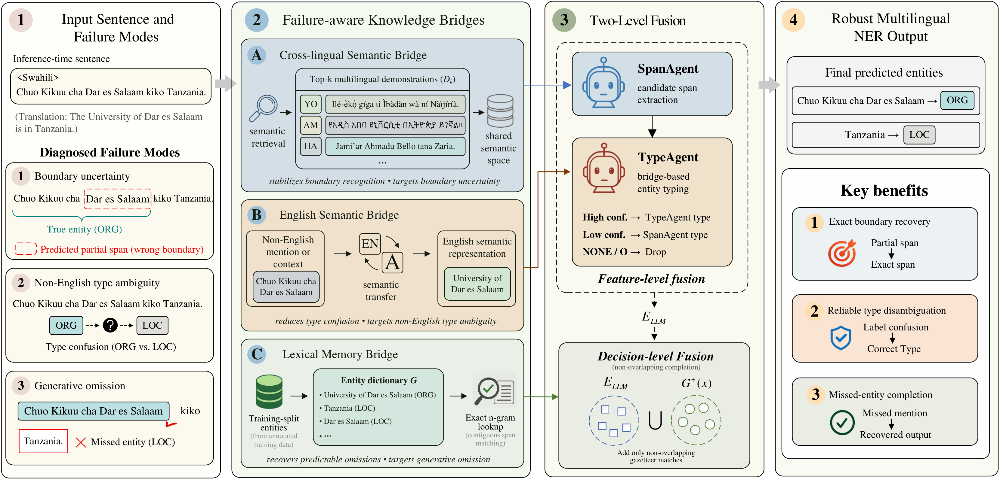

# FRAME

**Failure-aware Knowledge Bridging for Low-Resource Multilingual Named Entity Recognition with Large Language Models**



## Overview

Large language models enable in-context multilingual named entity recognition (NER) without per-language annotation or retraining, but flexibility alone does not guarantee reliability. FRAME identifies three distinct, separable failure modes in LLM-based multilingual NER — cross-lingual boundary uncertainty, non-English type ambiguity, and generative omission — and assigns each one a dedicated, read-only knowledge bridge at inference time:

- **Cross-lingual semantic bridge** (`SpanAgent`) — retrieves demonstrations through dense multilingual similarity to stabilize span boundaries.
- **English semantic bridge** (`TypeAgent`) — routes entity typing through translation with an explicit reject option to reduce type confusion.
- **Lexical memory bridge** (`Gazetteer`) — applies a corpus-derived gazetteer as a non-overlapping, decision-level completion step.

None of the three bridges updates model parameters or requires additional annotation beyond what the training splits already provide. FRAME runs two LLM calls per sentence (SpanAgent, then TypeAgent) plus a rule-based gazetteer merge.

## Key results

DeepSeek-V3, few-shot, entity-level micro-F1 (full comparison across GPT-4o, Qwen-2.5-72B, and zero-shot settings is in the paper):

| Method | WikiANN | CoNLL-03/02 | MasakhaNER2.0 |
|---|---|---|---|
| GPT-NER | 59.03 | 73.91 | 66.32 |
| CodeIE | 60.65 | 85.67 | 71.90 |
| KDR-Agent | 70.44 | 84.49 | 70.21 |
| **FRAME (Ours)** | **79.81** | **87.27** | **74.81** |

Ablation (DeepSeek-V3, k=3) — relative F1 decline from removing one bridge at a time:

| Variant | WikiANN | CoNLL-03/02 | MasakhaNER2.0 |
|---|---|---|---|
| **FRAME (Ours)** | **79.81** | **87.27** | **74.81** |
| w/o English bridge | 77.22 (−3.25%) | 86.28 (−1.13%) | 69.78 (−6.72%) |
| w/o lexical bridge | 75.64 (−5.22%) | 86.77 (−0.57%) | 72.87 (−2.59%) |

## Repository structure

```
FRAME-main/
├── model/
│   ├── agents/        # SpanAgent, TypeAgent (FRAME); CandidateAgent, RetrievalAgent (baseline pipelines only)
│   ├── backbones/      # LLM backend adapters (OpenAI-compatible: DeepSeek / GPT-4o / Qwen)
│   ├── data/            # Dataset loaders + quality-stratified sampling
│   ├── evaluation/    # Entity-level micro-F1
│   ├── pipeline/        # KARVEXPipeline (= FRAME), AblationPipeline, baseline pipelines
│   └── prompts/         # Prompt builders for each agent
├── utils/                  # Config loading, caching, JSON parsing, demo retrieval
├── scripts/
│   ├── run_ablation.py  # Entry point: runs FRAME + every ablation variant from one YAML config
│   └── evaluate.py        # Standalone metrics computation on saved predictions
├── configs/
│   ├── global.yaml               # Backend + path defaults
│   └── experiments/            # Per-dataset experiment configs (sample versions, max_samples=10)
├── sample_data/            # Small illustrative samples (WikiANN en/de/sw, CoNLL-03/02 en/de, MasakhaNER2.0 swa/hau)
└── assets/                  # Figures used in this README
```

`model/pipeline/karve_x_pipeline.py` implements FRAME; `KARVEXPipeline` is this module's internal historical class name (the project was developed under the name KARVE-X before the paper was finalized as FRAME).

`CandidateAgent` and `RetrievalAgent` are **not** part of FRAME's proposed architecture. They implement the Single-Agent and Naive-RAG baselines used for ablation and comparison in the paper (`model/pipeline/baseline_pipeline.py`).

## Installation

```bash
git clone https://github.com/PaErHaTi-DUTiR/FRAME-main.git
cd FRAME-main
pip install -r requirements.txt
```

Requires Python 3.10+.

## Configuration

FRAME calls an OpenAI-compatible chat completion endpoint. Set the relevant API key as an environment variable — never commit it to `configs/global.yaml`:

```bash
export DEEPSEEK_API_KEY="your-key-here"     # provider: deepseek (default in configs/global.yaml)
# export OPENAI_API_KEY="your-key-here"     # provider: openai / gpt-4
# export QWEN_API_KEY="your-key-here"       # provider: qwen
```

## Quickstart

`configs/experiments/` ships three ready-to-run configs, each pointed at the bundled `sample_data/` (10 test sentences, capped for a quick, low-cost check):

```bash
python scripts/run_ablation.py \
  --global-config configs/global.yaml \
  --experiment configs/experiments/ablf_wikiann_en.yaml
```

This runs full FRAME (`karve_x`) and every ablation variant (`wo_typeagent`, `wo_gazetteer`, `wo_crossdemo`, `single_agent`) on the 10 sample sentences and writes predictions + metrics under `outputs/`. Swap `--experiment` for `ablf_conll03_en.yaml` or `ablf_masakhaner_swa.yaml` to try the other two datasets. This makes real LLM API calls and will incur provider cost.

The cross-lingual bridge's dense retrieval mode downloads `paraphrase-multilingual-MiniLM-L12-v2` (~470MB) on first run; without internet access to Hugging Face, `DemoMemoryRetriever` falls back to a lexical (Jaccard) retrieval mode automatically.

## Reproducing the full paper results

The full-scale experiments in the paper use the complete WikiANN, CoNLL-03/02, and MasakhaNER2.0 training and test splits, which are not redistributed in this repository due to their size. To reproduce the full results:

1. Obtain the datasets from their original public sources (WikiANN, CoNLL-2003/2002, MasakhaNER2.0).
2. Convert each split into the same schema used in `sample_data/` — one JSON object per line, with `text`, `tokens`, and `entities` (`start`/`end`/`text`/`label`) fields — under `datasets/processed/<dataset>/<language>/<split>.jsonl`.
3. Point `configs/global.yaml`'s `paths.processed_root` at that directory and raise `limits.max_samples_per_language` in the experiment config.

## Citation

This manuscript is currently under review. The citation below will be completed upon acceptance.

## License

Apache License 2.0 — see [LICENSE](LICENSE).
